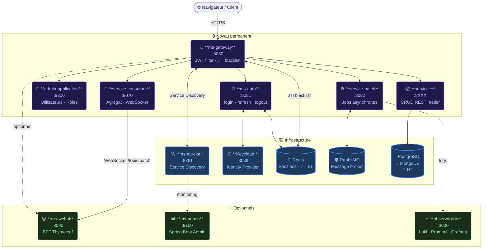

# springboot-platform-generator V5.5

Ce générateur produit un ZIP complet de la plateforme microservices validée V5.4.


La plateforme générée inclut :

- Eureka
- Gateway WebFlux (avec `TokenBlacklistFilter` réactif pour la révocation JWT)
- Keycloak
- `ms-auth` — service Spring Boot MVC encapsulant le password grant Keycloak ; expose `/auth/login`, `/auth/refresh`, `/auth/logout` avec tokens de rafraîchissement opaques et liste noire JTI Redis
- Spring Boot Admin
- `service-a`, `service-b`, `service-c`
- `service-consumer`
- `service-batch`
- `common-lib`
- Messages JSON RabbitMQ
- Stockage texte JSON Redis
- Notifications WebSocket batch
- Traitement batch configurable
- `test-all.sh`
- `tokens.env`
- `benchmark-async-batch.sh`
- `scale-batch.sh`

Valeurs par défaut du batch :

```env
BATCH_REPLICAS=4
BATCH_FILE_CONCURRENCY=5
BATCH_MIN_DELAY_MS=500
BATCH_MAX_DELAY_MS=1500
BATCH_MEMORY_LIMIT=768m
```

## Architecture de la plateforme générée

### Schéma global



---

### Services — fonctions et possibilités

#### `ms-eureka` — Service Discovery


- Serveur Eureka : registre central de tous les services
- Tous les modules s'y enregistrent au démarrage ; le gateway s'en sert pour le load balancing
- Interface Eureka accessible sur `:8761`

---

#### `ms-gateway` — Point d'entrée unique


- Reverse proxy **WebFlux** (non-bloquant) — route toutes les requêtes externes
- **TokenBlacklistFilter** : vérifie le JTI du JWT dans Redis avant chaque requête (révocation immédiate sans attendre l'expiration)
- Parse le JWT sans librairie dédiée (extraction du claim `realm_access.roles` en base64)
- Routes générées dynamiquement selon les modules activés (`CrossCuttingConfigProcessor`)

---

#### `ms-auth` — Authentification


- Encapsulation du **Keycloak password grant** — le client n'interagit jamais directement avec Keycloak
- `POST /auth/login` — identifiant + mot de passe → access token JWT + refresh token opaque
- `POST /auth/refresh` — rotation atomique du refresh token (Redis `GETDEL`) → nouveaux tokens
- `POST /auth/logout` — blacklist du JTI dans Redis → révocation immédiate sur toute la plateforme
- Refresh token opaque (UUID) stocké dans Redis avec TTL — non décodable côté client

---

#### `keycloak` — Fournisseur d'identité


- Realm `ms-realm` importé automatiquement au premier démarrage (JSON embarqué)
- Gestion des utilisateurs, mots de passe, rôles realm
- Utilisateurs de test pré-créés selon les services générés (`test-admin`, `test-<serviceName>`…)
- Console d'administration master sur `:8089` (compte `admin` / `admin`)

---

#### `admin-application` — Interface d'administration


- Interface **Thymeleaf** réservée au rôle `ROLE_ADMIN`
- **Gestion des utilisateurs** : liste paginée + recherche, création, édition (email/prénom/nom/actif), réinitialisation du mot de passe, suppression
- **Gestion des rôles** : créer / supprimer des rôles realm Keycloak, assigner / retirer des rôles par utilisateur
- Protections serveur : l'admin connecté ne peut pas se supprimer, ni modifier ses propres rôles, ni supprimer `ROLE_ADMIN`
- Thème Bootstrap 5.3 sombre (violet/cyan)

---

#### `common-lib` — Bibliothèque partagée


- DTOs communs (`BatchJobResult`…) partagés entre services via dépendance Maven
- Importée par `service-consumer`, `service-batch` et les services métier

---

#### `service-*` — Services métier


- **CRUD REST** complet : `GET /api/{resource}s`, `GET /{id}`, `POST`, `PUT /{id}`, `DELETE /{id}`
- **Base de données** configurable par service : PostgreSQL (défaut), MongoDB, H2 en mémoire
- **Type d'identifiant** configurable : `LONG` (défaut), `INTEGER`, `UUID` — automatiquement `String` pour MongoDB
- Accès sécurisé par JWT (rôle `USER_<SERVICE_NAME>` requis)
- Conteneur de base de données généré automatiquement dans docker-compose (sauf H2)

---

#### `service-consumer` — Agrégat & WebSocket


- `GET /api/aggregate` — appelle tous les services métier en parallèle et agrège les réponses (réservé `ROLE_ADMIN`)
- **Broker WebSocket** STOMP : publie les résultats de jobs batch sur `/topic/batch`
- Les clients (ms-webui, navigateur) s'y connectent via SockJS pour recevoir les notifications en temps réel

---

#### `service-batch` — Traitement asynchrone


- Consomme des jobs depuis **RabbitMQ** (messages JSON)
- Traitement configurable : concurrence fichiers (`BATCH_FILE_CONCURRENCY`), délais aléatoires, limite mémoire
- **Scalable horizontalement** : `BATCH_REPLICAS` instances parallèles via docker-compose `--scale`
- Publie le résultat de chaque job (jobId, status, count, durée, instance) via WebSocket → service-consumer
- Scripts fournis : `benchmark-async-batch.sh` (charge), `scale-batch.sh` (redimensionnement)

---

#### `ms-webui` — BFF Thymeleaf


- **Connexion / déconnexion** via ms-auth (session Redis, pas de JWT côté navigateur)
- **Tableau de bord** avec accès conditionnel selon les rôles (CRUD, Notifications, Chat, Consumer si ADMIN)
- **CRUD générique** sur tous les services métier générés (liste, création, édition, suppression)
- **Notifications batch** en temps réel (WebSocket SockJS/STOMP)
- **Chat** temps réel partagé entre tous les utilisateurs connectés
- **Mon compte** : affichage des rôles, lien réinitialisation mot de passe Keycloak
- Thème Bootstrap 5.3 sombre (violet/cyan)

---

#### `ms-admin` — Spring Boot Admin


- Monitoring de tous les services enregistrés dans Eureka
- Santé, métriques, threads, environnement, logs, JVM par service
- Thème sombre personnalisé (palette violet, mode sombre forcé)

---

#### `observability` — Stack de logs


- **Loki** — stockage et indexation des logs de tous les conteneurs
- **Promtail** — agent de collecte (monte `/var/lib/docker/containers`)
- **Grafana** (`:3000`) — visualisation, dont le tableau de bord "Batch Dashboard" pré-configuré
- Fuseau horaire `Europe/Paris` configuré sur toute la stack

---

## Lancer le générateur

```bash
mvn clean package
java -jar target/*.jar
```

## Générer la plateforme

### Champs de la requête

`POST /api/generate/platform` accepte un corps JSON correspondant à `PlatformGenerationRequest`. Tous les champs sont optionnels ; les valeurs par défaut sont indiquées ci-dessous.

| Champ | Type | Défaut | Effet |
| ----- | ---- | ------- | ------ |
| `name` | string | `ms-platform` | Nom du dossier racine dans le ZIP |
| `groupId` | string | `com.mr486` | `<groupId>` Maven dans tous les pom générés |
| `basePackage` | string | `com.mr486.msplatform` | Package Java racine pour tous les services |
| `javaVersion` | string | `17` | `<java.version>` dans le pom racine |
| `features` | objet | voir ci-dessous | Active/désactive les composants optionnels |
| `batch` | objet | voir ci-dessous | Configure le runtime de `service-batch` |
| `resources` | tableau | `[]` | Si non vide, remplace `service-a/b/c` par des services personnalisés |

#### `features`

Keycloak (+ `ms-auth`), Redis, RabbitMQ et WebSocket sont **toujours installés** — ils n'ont plus de bascule. `admin-application` (interface d'administration des utilisateurs/rôles Keycloak, réservée `ROLE_ADMIN`) est **toujours installée** également. Seuls les deux modules ci-dessous sont optionnels ; l'observabilité complète (loki + promtail + grafana) est pilotée par `batch.grafana`.

| Champ | Défaut | Quand `true`, inclut |
| ----- | ------- | -------------------- |
| `springbootAdmin` | `false` | `ms-admin/` — interface de monitoring Spring Boot Admin (`:9100`) |
| `webUI` | `false` | `ms-webui/` — interface BFF Thymeleaf (`:8090`) : connexion via ms-auth, agrégat consumer, CRUD générique, notifications batch en direct, chat public |

Les indicateurs hérités/inconnus (`keycloak`, `redis`, `rabbitmq`, `websocket`, `admin`, `grafana`, `loki`) sont **ignorés** — une requête les contenant se désérialise correctement (Jackson `FAIL_ON_UNKNOWN_PROPERTIES=false`), ces indicateurs sont simplement ignorés.

#### `batch` (valeurs par défaut correspondant à la plateforme validée)

```json
{ "enabled": true, "grafana": false, "replicas": 4, "fileConcurrency": 5,
  "minDelayMs": 500, "maxDelayMs": 1500, "memoryLimit": "768m" }
```

Quand `enabled: false`, `service-batch/` (module + bloc docker-compose) est exclu. Quand `grafana: true`, la stack d'observabilité complète est installée (`observability/` = loki + promtail + grafana, avec leurs blocs compose).

#### `resources[]` (`ResourceModuleRequest`)

| Champ | Type | Obligatoire | Notes |
| ----- | ---- | -------- | ----- |
| `serviceName` | string | oui | kebab-case, utilisé comme nom de module et de dossier (ex. `order-service`) |
| `className` | string | oui | PascalCase pour la classe entité (ex. `Order`) |
| `routePrefix` | string | non | Par défaut `/api/{classNameLower}s` (ex. `Order` → `/api/orders`) |
| `databaseType` | enum | non | `POSTGRES` (défaut), `H2` (en mémoire, sans conteneur db), `MONGO` |
| `idType` | enum | non | `LONG` (défaut), `INTEGER`, `UUID`. Ignoré pour `MONGO` (toujours `String`) |

Quand `resources` est non vide, les modules `service-a/b/c` par défaut + leurs blocs docker-compose + entrées de volumes sont supprimés et remplacés par un bloc par resource (POSTGRES/MONGO obtiennent un bloc `*-db` et un volume nommé ; H2 n'en a pas).

### Exemple minimal — 1 service, tout par défaut

```bash
curl -X POST http://localhost:8080/api/generate/platform \
  -H "Content-Type: application/json" \
  -d '{
    "resources": [
      { "serviceName": "order-service", "className": "Order" }
    ]
  }' \
  --output ms-platform.zip
```

Cela produit une plateforme complète avec Keycloak + ms-auth + Eureka + Gateway + `admin-application` (toujours installée) + un unique `order-service` sur PostgreSQL, avec les routes `/api/orders`. `ms-admin` et `ms-webui` sont absents (tous deux désactivés par défaut) ; l'observabilité est absente (`batch.grafana` à false par défaut).

### Exemple complet — 3 services, tous les indicateurs explicites

```bash
curl -X POST http://localhost:8080/api/generate/platform \
  -H "Content-Type: application/json" \
  -d '{
    "name": "ms-platform",
    "groupId": "com.acme",
    "basePackage": "com.acme.shop",
    "javaVersion": "17",
    "resources": [
      {
        "serviceName": "order-service",
        "className": "Order",
        "routePrefix": "/api/orders",
        "databaseType": "POSTGRES",
        "idType": "LONG"
      },
      {
        "serviceName": "product-service",
        "className": "Product",
        "routePrefix": "/api/products",
        "databaseType": "MONGO"
      },
      {
        "serviceName": "inventory-service",
        "className": "Item",
        "routePrefix": "/api/items",
        "databaseType": "H2",
        "idType": "UUID"
      }
    ],
    "batch": {
      "enabled": true,
      "grafana": true,
      "replicas": 4,
      "fileConcurrency": 5,
      "minDelayMs": 500,
      "maxDelayMs": 1500,
      "memoryLimit": "768m"
    },
    "features": {
      "springbootAdmin": true,
      "webUI": true
    }
  }' \
  --output ms-platform.zip
```

Cela produit la plateforme complète : noyau permanent (keycloak/ms-auth/redis/rabbitmq/eureka/gateway/service-consumer + `admin-application`), les trois services personnalisés, `service-batch`, l'observabilité complète (`batch.grafana=true`), ainsi que les deux modules optionnels `ms-admin` et `ms-webui`.

## Utilisateurs Keycloak

Le realm `ms-realm` est importé au premier démarrage avec les utilisateurs de test ci-dessous
(définis dans `keycloak/import/ms-realm-realm.json`). Mots de passe **permanents** (non temporaires).

| Utilisateur | Mot de passe | Rôles realm |
| ----------- | ------------ | ----------- |
| `test-admin` | `admin123` | `ADMIN`, `USER_BATCH`, `USER_SERVICE_A`, `USER_SERVICE_B`, `USER_SERVICE_C` |
| `test-batch` | `user123` | `USER_BATCH` |
| `test-service-a` | `user123` | `USER_SERVICE_A` |
| `test-service-b` | `user123` | `USER_SERVICE_B` |
| `test-service-c` | `user123` | `USER_SERVICE_C` |

Rôles realm définis : `ADMIN`, `USER_BATCH`, `USER_SERVICE_A`, `USER_SERVICE_B`, `USER_SERVICE_C`, `SERVICE`.
Seul `test-admin` (rôle `ADMIN`) peut se connecter à `admin-application` (`:9300`) et à `ms-webui` (`:8090`).

**Console d'administration Keycloak** (`http://localhost:8089`) — compte master, distinct des utilisateurs du realm :

| Utilisateur | Mot de passe | Source (`.env`) |
| ----------- | ------------ | --------------- |
| `admin` | `admin` | `KEYCLOAK_ADMIN` / `KEYCLOAK_ADMIN_PASSWORD` |

> **Mode `resources[]`** : quand `resources` est non vide, `service-a/b/c` disparaissent et le realm est
> réécrit en conséquence — les utilisateurs `test-service-a/b/c` sont remplacés par un `test-<serviceName>`
> par resource (mot de passe `user123`, rôle `USER_<SERVICE_NAME>`), et `test-admin` reçoit le rôle de
> chaque resource. Exemple avec `order-service` : utilisateur `test-order-service` / `user123`, rôle
> `USER_ORDER_SERVICE`.

## Tester la plateforme générée

```bash
unzip -o ms-platform.zip
cd ms-platform

docker compose down -v
./prod-start.sh
./test-all.sh
source tokens.env
./benchmark-async-batch.sh 10 5
```

Résultat attendu :

```txt
10 HTTP 202
10 COMPLETED
```

## Observabilité générée

Le projet généré inclut une stack légère :

- Loki
- Promtail
- Grafana
- Tableau de bord Batch v2

Après génération du projet :

```bash
cp dist.env .env
./prod-start.sh
./test-all.sh
source tokens.env
./benchmark-async-batch.sh 10 5
```

Puis ouvrir :

```txt
http://localhost:3000
admin / admin
```

Tableau de bord : `Batch / Batch Dashboard`.

## Fuseau horaire

Les projets générés configurent `TZ=Europe/Paris` pour Loki, Promtail et Grafana. Dans Grafana, utiliser de préférence `Browser Time`.

## Notes du projet (mémoire Claude)

`docs/claude-memory/` contient un instantané versionné des notes persistantes
que Claude Code maintient tout au long du projet. Utile lors de la revue de PRs
ou de l'intégration de nouveaux membres pour comprendre *pourquoi* certains choix
de conception ont été faits (ex. le gateway parse le JTI JWT sans librairie dédiée,
ou pourquoi `CrossCuttingConfigProcessor` s'exécute à `@Order(60)`).

Commencer par [`docs/claude-memory/README.md`](docs/claude-memory/README.md) et
[`docs/claude-memory/MEMORY.md`](docs/claude-memory/MEMORY.md) (l'index).
L'instantané est synchronisé automatiquement depuis la mémoire Claude active dans
`~/.claude/projects/.../memory/` ; la copie active est la source de vérité.
